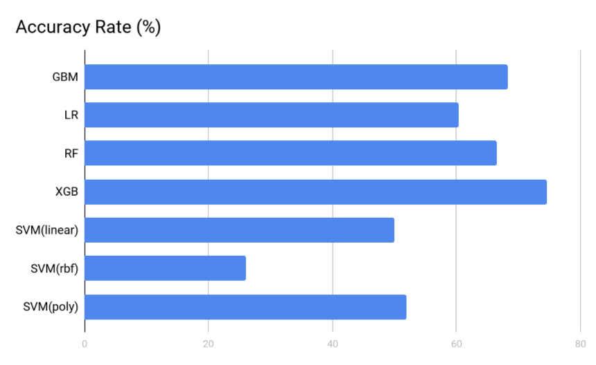
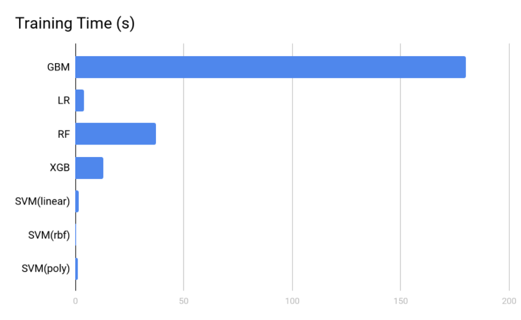

# ADS Project 5: Urban Sound Classification

Term: Fall 2017

+ Group 4
+ Projec title: Urban Sound Classification
+ Team members
	+ Chen, Tiantian
	+ Li, Yijia
	+ Lin, Han
	+ Shi, Qian
	+ Zhou, Xiaoyu (Presenter)

+ **Project summary**: This is a project to classify unban sounds automatically with machine learning models. Our data comes from Urban Sound Dataset, which contains 1302 labeled sound recordings from 10 different classes. We extracted 193 features from these recordings, covering the features of melspectrogram, mfcc, chorma-stft, spectral_contrast and tonnetz. We split the original data and used 70% of them to train the models of GBM, Linear Regression, Random Forest, XGBoost and SVM (with 3 different kernels: linear, rbf, poly), which were applied to classify the left 30% data. Best result was produced by XGBoost, with a accuracy rate of around 75%. Apart from total accuracy rate, we also compared the training time consumed by different models and accuracy rate for each class. 

+ **Data**
	+ Source: [Urban Sound Dataset](https://serv.cusp.nyu.edu/projects/urbansounddataset/)
	+ Size: 1302 labeled sound recordings
	+ Format: each recording is a wav file
	+ Content: 10 classes of sounds ( air_conditioner, car_horn, children_playing, dog_bark, drilling, enginge_idling, gun_shot, jackhammer, siren, and street_music )
	+ Usage: 30% of the data is regarded as test data

+ **Feature**
	+ Tool: Librosa library in Python
	+ Methods: 
		+ melspectro gram (Compute a Mel-scaled power)
		+ mfcc: Mel-frequency cepstral coefficients
		+ chorma-stft: chromagram from a waveform/power spectrogram
		+ spectral_contrast: Compute spectral contrast, using method
		+ tonnetz: Computes the tonal centroid features (tonnetz)
	+ Output: Matrix of 1102 rows, 193 columns

+ **Result Comparation**


<!-- .element height="20%" width="20%" -->


+ **Improvement**
    + Use a lager dataset on the [official website](https://serv.cusp.nyu.edu/projects/urbansounddataset/) which contains more than 8000 audio records with these 10 different classes. Intuitively, more data available,  more accurate for model performs.
    + Setup a more complex CNN with at least 10 layers, and with some other techniques, such as adding zero-padding or dropout layer to classify those audios.
    + Try to use differenct combinations within those five kinds of features we extracted.  We have assumed that perhaps some kinds of the features are much more outstanding than others. So why not try to ignore those "unuseful" features, at some points, reduce dimensions, and train the model on the subset of the features. The result could be exciting, or not.
    + Try to extract other kinds of features.
	
+ **Contribution statement**: ([default](doc/a_note_on_contributions.md)) All team members contributed equally in all stages of this project. All team members approve our work presented in this GitHub repository including this contributions statement.

Following [suggestions](http://nicercode.github.io/blog/2013-04-05-projects/) by [RICH FITZJOHN](http://nicercode.github.io/about/#Team) (@richfitz). This folder is orgarnized as follows.

```
proj/
├── lib/
├── data/
├── doc/
├── figs/
└── output/
```

Please see each subfolder for a README file.

**Reference**: 

[Urban Sound Classification](http://aqibsaeed.github.io/2016-09-03-urban-sound-classification-part-1/)

[Librosa](http://librosa.github.io)
